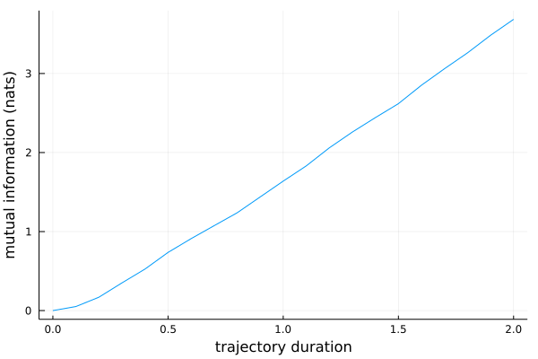

# PathWeightSampling.jl

PathWeightSampling.jl is a Julia package to compute information transmission rates using the Path Weight Sampling (PWS) method.

## Background

Information is a fundamental resource in complex systems at all scales, from bacterial signaling networks to artificial neural networks. 
These systems receive input signals which are analyzed, filtered, transcoded, or otherwise transformed to yield an output signal.
The generic mathematical framework to study the flow of information in these systems is *information theory* which defines a central quantity to quantify the amount of information that the output contains about the input: the *mutual information*. Specifically, this measure quantifies the number of distinct mappings between input and output that can be distinguished uniquely and is thus a measure of the fidelity of the input-output relationship.

Mathematically, the mutual information between two random variables, ``S`` and ``X`` is defined as

```math
\mathrm{I}(S, X) = \sum_{s\in S, x\in X} \mathrm{P}(s, x) \ln\frac{\mathrm{P}(s, x)}{\mathrm{P}(s) \mathrm{P}(x)} \,.
```

However, the mutual information between scalar random variables ``S`` and ``X`` does not quantify the *rate* of information transmission. Indeed, most systems receive time-dependent input signals, i.e. a sequence of messages over time, which are transformed into a time-dependent output signal. 
In most systems a given input message is not independent from previous input messages. These autocorrelations within the input reduce the rate at which information is received. Additionally, correlations within the output signal can also reduce the information transmission rate. Hence, to quantify the rate of information transmission, the instantaneous mutual information between scalar random variables $S$ and $X$ is not sufficient, and we require a better mutual information measure.

The solution to this problem is to compute the mutual information between entire trajectories of input and output, not between input and output values at given time points. In this way, correlations within the input and the output are taken into account when computing the mutual information. The mathematical form of the trajectory mutual information is analogous to the scalar case:

```math
\mathrm{I}(\bm{S}, \bm{X}) = \sum_{\bm{s}\in \bm{S}, \bm{x}\in \bm{X}} \mathrm{P}(\bm{s}, \bm{x}) \ln\frac{\mathrm{P}(\bm{s}, \bm{x})}{\mathrm{P}(\bm{s}) \mathrm{P}(\bm{x})}
```

but now the sum runs over all possible input and output trajectories (which are denoted using bold symbols), not unlike a path integral. 
The information transmission rate ``\mathrm{R}(\bm{S}, \bm{X})`` is then defined as the asymptotic rate at which the trajectory mutual information increases with the duration of the input and output trajectories, i.e.

```math
\mathrm{R}(\bm{S}, \bm{X}) = \lim_{T\rightarrow\infty} \frac{\mathrm{d}\mathrm{I}(\bm{S}_T, \bm{X}_T)}{\mathrm{d}T}
```

where ``\bm{S}_T`` and ``\bm{X}_T`` are trajectory-valued random variables of trajectories with duration ``T``.

PWS is a novel method to compute the mutual information between input and output trajectories for systems described by a master equation. 

## Installation

From the Julia REPL, type
```
julia> import Pkg; Pkg.add("PathWeightSampling")
```

Alternatively, you can install this package by starting Julia, typing `]` and then
```
pkg> add PathWeightSampling
```

## Quick Start

After installation, the package can be loaded from directly from julia.
```julia
julia> import PathWeightSampling as PWS
```
We then need a *system* of reactions for which we want to compute the mutual information. We can use one of the included example systems, such as a simple model for gene expression.
```julia
julia> system = PWS.gene_expression_system()
SimpleSystem with 4 reactions
Input variables: S(t)
Output variables: X(t)
Initial condition:
    S(t) = 50
    X(t) = 50
Parameters:
    κ = 50.0
    λ = 1.0
    ρ = 10.0
    μ = 10.0
```
This specific model is very simple, consisting of only 4 reactions:

- ∅ → S with rate *κ*
- S → ∅ with rate *λ*
- S → S + X with rate *ρ*
- X → ∅ with rate *μ*

S represents the input and X represents the output. The values of the parameters
can be inspected from the output above.
For this system, we can perform
a PWS simulation to compute the mutual information between its input and output trajectories:

```julia
julia> result = mutual_information(system, DirectMCEstimate(256), num_samples=1000)
```

Here we just made a default choice for which marginalization algorithm to use.
This computation takes approximately a minute on a typical laptop. The result 
is a `DataFrame` with three columns and 1000 rows:

```julia
1000×3 DataFrame
  Row │ TimeConditional  TimeMarginal  MutualInformation                 
      │ Float64          Float64       Vector{Float64}                   
──────┼──────────────────────────────────────────────────────────────────
    1 │     0.000180898     0.0508378  [0.0, -0.67167, 0.388398, -0.343…
  ⋮   │        ⋮              ⋮                        ⋮
 1000 │     0.00020897      0.0694072  [0.0, 0.254173, 0.362607, 0.2584…
                                                         998 rows omitted
```

Each row represents one Monte Carlo sample.

- `TimeConditional` is the CPU time in seconds for the computation of the conditional probability P(**x**|**s**)
- `TimeMarginal` is the CPU time in seconds for the computation of the marginal probability P(**x**|**s**)
- `MutualInformation` is the resulting mutual information estimate. This is a vector for each sample giving the mutual information for trajectories of different durations. The durations to which these individual values correspond is given by

```julia
julia> system.dtimes
0.0:0.1:2.0
```

So we computed the mutual information for trajectories of duration `0.0, 0.1, 0.2, ..., 2.0`.

We can plot the results (assuming the package Plots.jl is installed):

```julia
julia> using Plots, Statistics
julia> plot(
           system.dtimes,
           mean(result.MutualInformation),
           legend=false,
           xlabel="trajectory duration",
           ylabel="mutual information (nats)"
       )
```



Here we plot `mean(result.MutualInformation)`, i.e. we compute the average of our Monte Carlo samples, which is the PWS estimate for the mutual information.

## Acknowledgments

This work was performed at the research institute [AMOLF](https://amolf.nl).
This project has received funding from the European Research Council (ERC) under the European Union’s Horizon 2020 research and innovation program (grant agreement No. 885065)
and was financially supported by the Dutch Research Council (NWO) through the “Building a Synthetic Cell (BaSyC)” Gravitation grant (024.003.019).

[](https://www.nwo.nl)
[](https://amolf.nl)
[](https://www.basyc.nl)