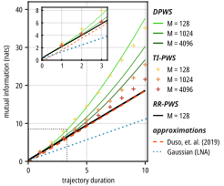
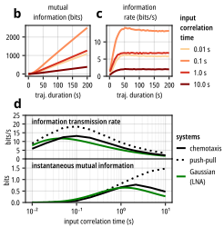

# Figures

This directory contains the code required to reproduce the following figures appearing in the PWS manuscript.

## Gene Expression Results

This figure can be recreated by running the script `figure_gene_expr/figure_gene_expr.jl`.

## Chemotaxis Results

This figure can be recreated by running the script `figure_chemotaxis/generate_figure.jl`